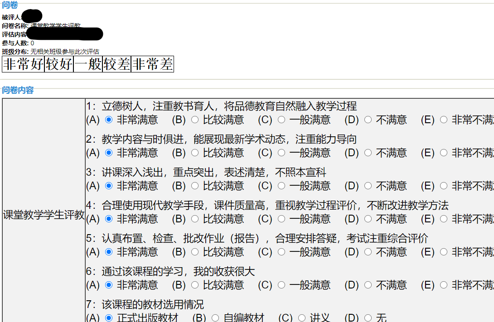

# 河海大学教务系统一键评教脚本
你是否为期末评教众多的评教选项感到烦恼？
你是否为评教选项的难以点击心烦气躁？
你是否为教师评语苦恼而不知如何下手？
你无需烦恼，在[此处](https://greasyfork.org/zh-CN/scripts/405617-%E6%B2%B3%E6%B5%B7%E5%A4%A7%E5%AD%A6-%E5%B8%B8%E5%B7%9E-%E6%95%99%E5%8A%A1%E7%B3%BB%E7%BB%9F%E4%B8%80%E9%94%AE%E8%AF%84%E6%95%99%E8%84%9A%E6%9C%AC)安装这款脚本，小手一点，食指轻敲，一键解君愁！
### 适用场景
- 教务系统评教页面
- [河海大学常州校区](http://202.119.113.135/xkgg.html)（江宁/西康路校区可以试试，不保证可用）

### 基本功能
- 提供5个按钮一键选中评教单选项
- 一键同时设置好教师评语

### 示例

### 注意
- 一键选择后，请手动点击提交

### 最后
如果您觉得此脚本有所帮助，请麻烦右上角点一下 :star:，谢谢！
