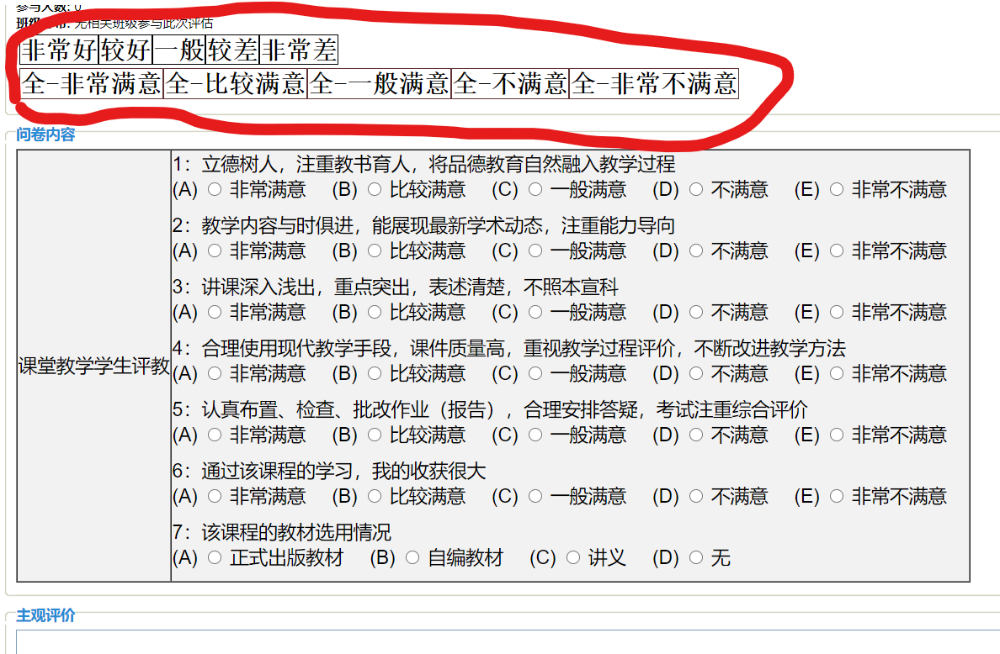

# 河海大学教务系统 评教辅助脚本
点击 [此处](https://greasyfork.org/zh-CN/scripts/405617-%E6%B2%B3%E6%B5%B7%E5%A4%A7%E5%AD%A6-%E5%B8%B8%E5%B7%9E-%E6%95%99%E5%8A%A1%E7%B3%BB%E7%BB%9F%E4%B8%80%E9%94%AE%E8%AF%84%E6%95%99%E8%84%9A%E6%9C%AC) 安装脚本，即可简化评教，省去频繁的点击鼠标。

### 适用场景
> 网址如下：
- http://202.119.113.135/
- http://202.119.113.136/
- http://202.119.113.147/
- http://202.119.113.148/
- http://jwxt1.hhu.edu.cn/
- http://jwxt2.hhu.edu.cn/
- http://jwxt3.hhu.edu.cn/
- http://jwxt4.hhu.edu.cn/

### 基本功能
- 提供5个按钮（上方）一键选中评教单选项（随机选择）
- 提供5个按钮（下方）一键选中评教单选项（全为相同项，如：都是比较满意）
- 一键同时设置好简单的教师评语

### 示例

### 注意
- 一键选择后，请手动点击提交
- 请在尊重客观事实的基础上，尽量给老师好评

### 最后
如果您觉得此脚本有所帮助，请麻烦右上角点一下 :star:，谢谢！
